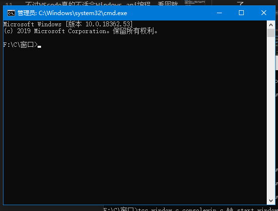

# ConsoleWindow
## 项目简介
“ConsoleWindow”是一个可以在cmd中绘制窗口的库。不过，只能**绘制**窗口，原生不能进行交互。现在支持以下控件:

- Window:窗口
- Text:文本
- Button:按钮
- LongText:长文本(字面意思)
- Progress:进度条

> 注意:本库用到了`windows.h`，因此只能在`Windows NT`上运行。

## Demo
### 1.Window
十分简单的Demo。开始会让你下载什么文件，就像平时下载文件一样，卡在99%...最后就是——Creeper?

### 2.YourDosInstaller
这个Demo有一点长，不过还是很简单。这是一个安装程序，安装时可以按`Ctrl+方向键`来改变窗口位置，`左方向键`选择`Exit`，`右方向键`选择`Install`，`空格`和`回车`按下选择的按钮。安装完成之后，打开一看：先是营销号一般的操作，然后启动了...是Window自带的cmd!

生成的.bat文件。

> 要卸载的话，直接把桌面上的`YourDos.bat`扔进回收站就行了。

## 后
不过VScode真的不适合Windows api编程，看图就知道了。

我注释也没写多少，以后再补吧...
